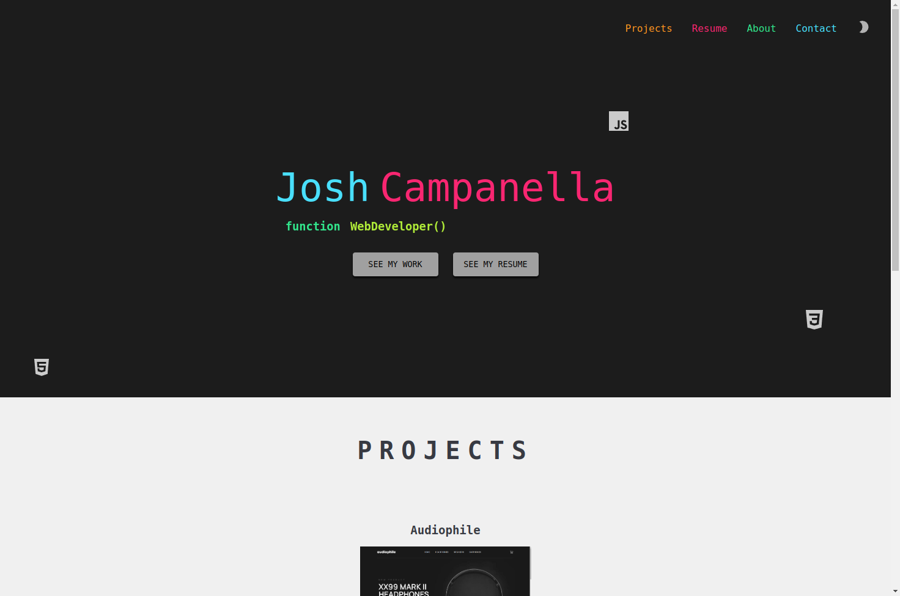

# Portfolio

A showcase of my web development skills, with links to completed projects and github repositories

## About

VS Code highlights are the inspiration for my portfolio's design. I used the same fonts and color schemes that I use in VS Code. The project itself was built with React. It has a 'scrollTo' navbar, light mode/dark mode selector, and 'back to top' button that appears after scrolling down a little bit.  I included previews of my projects as well as links to the live web sites and github repos.  My resume is also live on the portfolio itself and can be downloaded by clicking one of the buttons.  Finally, I have a contact form that emails form submissions to me using Nodemailer. I'm not much of a designer, but I can at least make things look decent. That's subjective, of course.

## Project Screen Shot(s)

## Live Demo

https://joshcamp.dev/

## Dependencies

*Nodemailer

*React-scroll

*Node.js

*Express.js

*React.js

## Authors

Josh Campanella  
[Portfolio](https://joshcamp.dev)

## Version History

* 0.1
    * Initial Release

## Acknowledgments

Inspiration, code snippets, etc.

* [Nodemailer](https://nodemailer.com/)
* [React-scroll](https://www.npmjs.com/package/react-scroll)
* [Node](https://nodejs.org/)
* [Express.js](https://expressjs.com/)
* [React.js](https://leafletjs.com/)